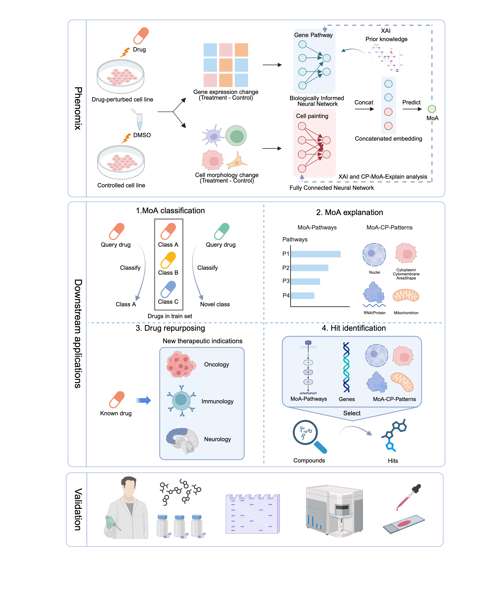

<div align="center">

# Phenomix

**Explainable multimodal phenotypic drug discovery via Phenomix**

</div>

<p align="center">
  
</p>

## Overview

Phenomix is a multi-modal biologically informed explainable AI framework that translates chemical-perturbation-induced cell morphology and transcriptome into mechanistic and therapeutic insights for phenotypic drug discovery. Phenomix can classify drugs, elucidate compound-associated MoA, perform mechanism-guided drug repurposing, and identify high-confidence hits in an XAI way, especially for undruggable targets. Evaluated on the large-scale chemical-perturbation-induced transcriptome and Cell Painting based phenotype screening datasets, the capacity of Phenomix are extensively demonstrated and validated.

By providing mechanistic insights into compound-induced phenotypes, Phenomix helps transform vast collections of compounds from largely unexplored chemical space into actionable therapeutic knowledge, enabling researchers to more efficiently uncover promising drug candidates and their underlying biological mechanisms. We anticipate that Phenomix will contribute to the continued advancement of the phenotypic drug discovery field.

## Repository structure

```text
.
├── Phenomix.py             # Neural network, dataset wrapper, and explanation functions
├── Phenomix_utils.py       # Reactome mapping and label/probe utilities
├── readProfiles.py         # Cell Painting/L1000 loading and preprocessing
├── reactome.py             # Reactome hierarchy and pathway helpers
├── tutorial.ipynb          # End-to-end LINCS walkthrough
├── requirements.txt        # Recorded runtime dependency bounds
├── picture/
│   └── phenomix-overview.png
└── dataset/
    ├── RepCorrDF.xlsx      # Replicate-correlation support data
    ├── idmap.csv           # L1000 probe-to-gene mapping
    └── Reactome/           # Pathway names, hierarchy, and gene memberships
```
## Installation

* Clone the repository:
```git clone git@github.com:DELTA-TJ-submission/Phenomix.git```

## Setup a Python virtual environment (recommended)

* Create the virtual environment: 
```conda create -n phenomix_env python=3.9```

* Activate the environment:
```conda activate phenomix_env```

* Install all the required packages in the virtual environment (this should take a few minutes):  
```pip --no-cache-dir install -r requirements.txt```  
Packages can also be installed individually using the versions 
provided in the ```requirements.txt``` file; for example:
```pip install pandas==1.3.5```

## Prepare the input data

The LINCS and CDRP-bio datasets with matched gene expression and cell painting data used in our study are publicly available at [carpenter-singh-lab/2022_Haghighi_NatureMethods](https://github.com/carpenter-singh-lab/2022_Haghighi_NatureMethods).

The loader recognizes the following dataset keys and directory names:

| Dataset key | Expected directory |
| --- | --- |
| `LINCS` | `LINCS-Pilot1` |
| `CDRP-bio` | `CDRPBIO-BBBC036-Bray` |


## Get started

See [tutorial.ipynb](tutorial.ipynb) for examples of using Phenomix. After downloading the LINCS and CDRP-bio datasets, please replace the example data paths with the paths to your downloaded datasets:

   ```python
   procProf_dir = "/absolute/path/to/data-root"
   ```

## Citation
Shaoqi Chen et al. Explainable multimodal phenotypic drug discovery via Phenomix, biorxiv, 2026.

## Contacts
bm2-lab@tongji.edu.cn

csq_@tongji.edu.cn